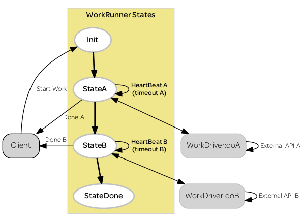

### Timeout Pattern

**How to time out ongoing work from a typical FSM manager actor?**

Typically we need to manage long running external API calls that are prone to failure (e.g. launch a instance with the EC2 API). The external work may get stuck - at some point we need to decide to give up and deal with the failure.

Here we simulate work with a worker that takes a specified time (``WorkDriver`` actor). We also specify a timeout value in the FSM manager (``WorkRunner`` actor). The timeout message flow is triggered by sinply specyfying a higher work time than timeout.



To demonstrate, run ``$ sbt test-only WorkRunnerTest``.
This takes the WorkRunner FSM through all three scenarios:

1. Successful run through both work phases (timeout values higher than work times in both cases)
1. Timeout in phase A
1. Timeout in phase B


```bash
> test-only WorkRunnerTest
[info] Compiling 1 Scala source to ./akka-message-pattern-explore/target/scala-2.11/test-classes...
[warn] there were 9 feature warnings; re-run with -feature for details
[warn] one warning found
[WARN] [08/01/2015 12:25:50.983] [WorkDriverTest-akka.actor.default-dispatcher-4] [akka://WorkDriverTest/user/manager0] unhandled event HeartBeatB(150 milliseconds) in state StateB
[WARN] [08/01/2015 12:25:51.271] [WorkDriverTest-akka.actor.default-dispatcher-4] [akka://WorkDriverTest/user/manager0] unhandled event HeartBeatA(150 milliseconds) in state StateDone
[WARN] [08/01/2015 12:25:52.660] [WorkDriverTest-akka.actor.default-dispatcher-3] [akka://WorkDriverTest/user/manager2] unhandled event HeartBeatB(50 milliseconds) in state StateB
[info] WorkRunnerTest:
[info] An WorkRunner actor
[info] - must complete all the work phases in the absence of timeouts
[info]   + Completed A in 500 milliseconds
[info]   + measured as  608 milliseconds
[info]   + Completed B in 250 milliseconds
[info]   + measured as  1004 milliseconds
[info]
[info] - must sense timeouts and abort work in the first phase
[info]   + Timeout after 550 milliseconds
[info]   + measured as  771 milliseconds
[info]
[info] - must sense timeouts and abort work in the second phase
[info]   + Completed A in 500 milliseconds
[info]   + measured as  599 milliseconds
[info]   + Timeout after 550 milliseconds
[info]   + measured as  1347 milliseconds
[info]
[info] Run completed in 3 seconds, 506 milliseconds.
[info] Total number of tests run: 3
[info] Suites: completed 1, aborted 0
[info] Tests: succeeded 3, failed 0, canceled 0, ignored 0, pending 0
[info] All tests passed.
[success] Total time: 4 s, completed Aug 1, 2015 12:25:53 PM

```  